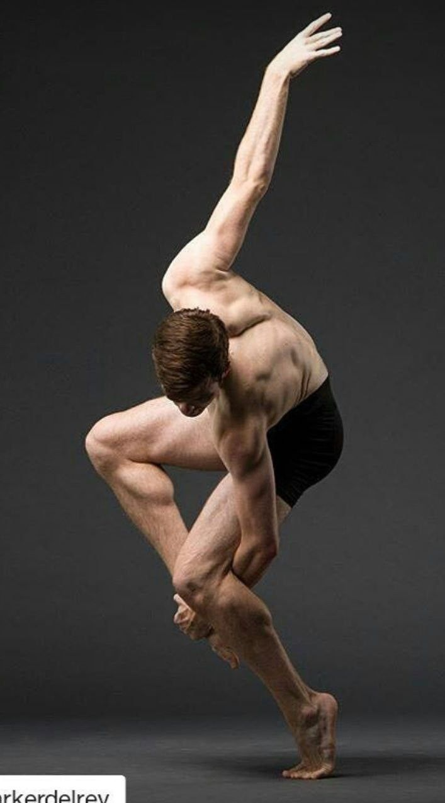
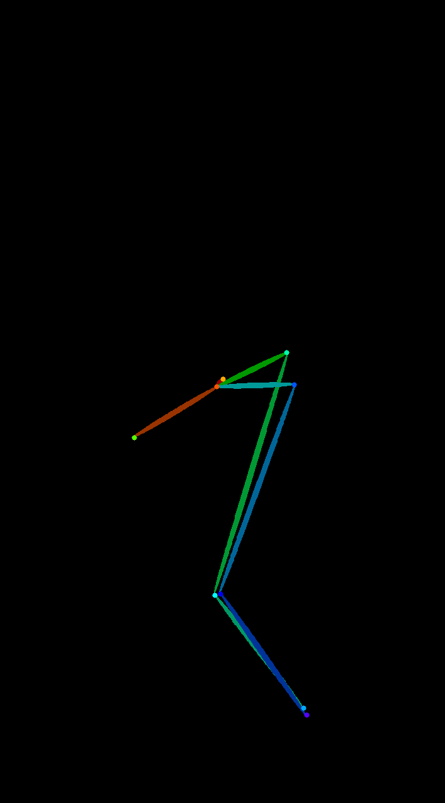
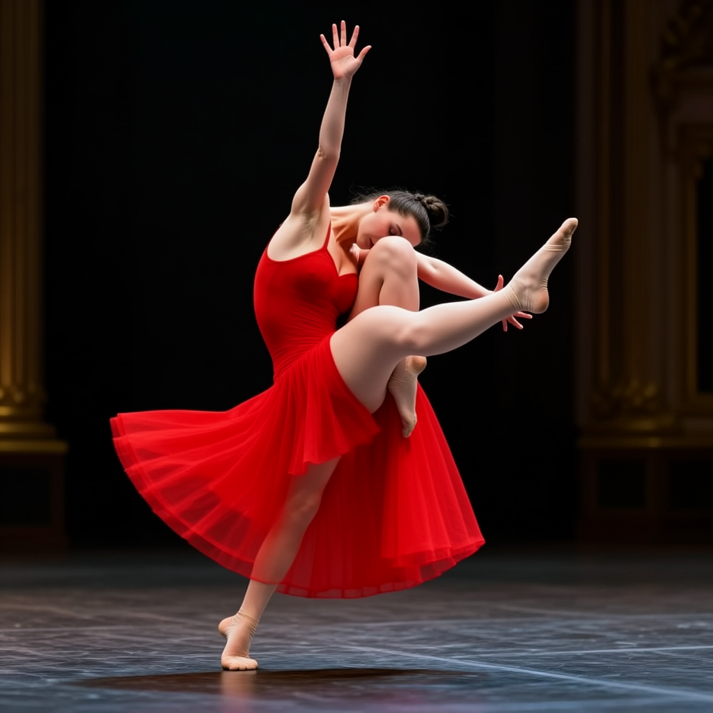
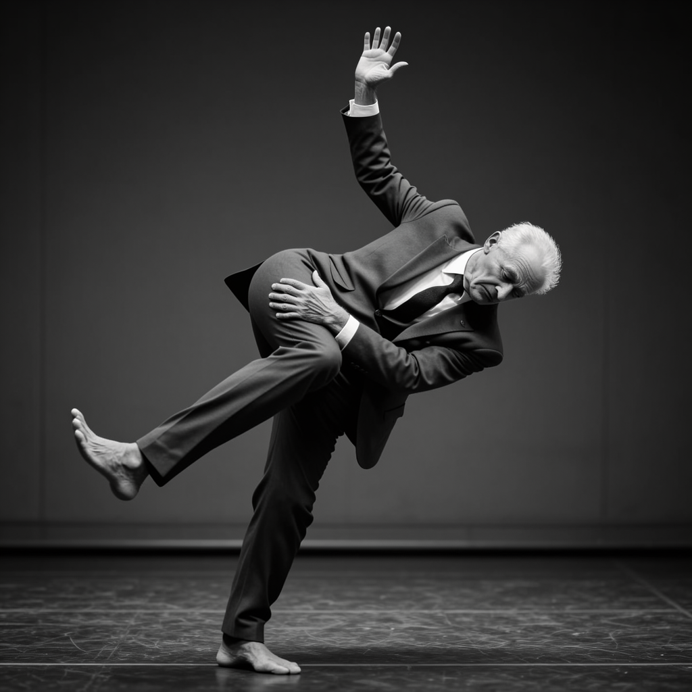
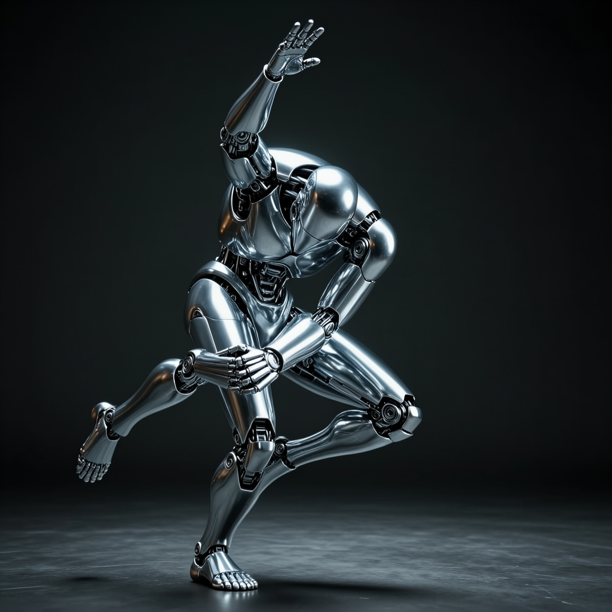

# 원하는 포즈로 이미지 만드는 도구

## 도구 설명
- 참조 사진 한 장에서 OpenPose로 사람의 관절(포즈)만 뽑아내고, 그 포즈는 그대로 유지한 채 ControlNet + FLUX.2-klein 4B로 완전히 다른 인물/장면 이미지를 생성한다.

## 사용법
1. 로컬(Apple Silicon Mac, MPS)에서 `pose_tool.ipynb`를 Jupyter로 연다. (Colab이 아니라 로컬 실행 기준)
2. 셀을 순서대로 실행한다: ① 라이브러리 설치 → ② 참조 사진 로드 → ③ OpenPose로 스켈레톤 추출 → ④ FLUX.2-klein-base-4B + ControlNet 모델 로드(최초 1회, 약 24GB 자동 다운로드) → ⑤ 프롬프트별 이미지 생성.
3. 결과 이미지는 `outputs/pose_skeleton.png`(추출된 스켈레톤)와 `outputs/output_0N.png`(생성 결과)로 저장된다.

## 테스트 결과
- 포즈 1: 몸을 앞으로 숙이고 한 팔은 하늘로 뻗고 다른 팔은 굽힌 다리를 감싸 안은 역동적인 무용 자세 → 프롬프트: "빨간 드레스를 입은 발레리나 / 정장을 입은 노년 남성 / 크롬 금속 재질의 로봇, 각각 같은 자세" → 결과: 세 인물 모두 자세가 잘 반영됨 (`samples/output_01~03.png`)
- 원본 참조 사진: `samples/original_01.jpg` (출처: Instagram @parkerdelrey — 개인 학습·실험 목적의 참조용, 상업적 재배포 아님)

| 원본 사진 | 추출된 포즈 스켈레톤 | 발레리나 | 노년 남성 | 로봇 |
|---|---|---|---|---|
|  |  |  |  |  |

- 첫 시도(스텝 12, "portrait" 계열 정적 구도 단어 포함): 자세가 거의 반영되지 않고 평범한 정면 인물사진이 나옴 → 어긋남
- 재시도(자세를 프롬프트에 직접 서술, 스텝 25): 세 이미지 모두 원하는 역동적 포즈로 잘 나옴 → 잘 됨 (현재 `samples/`에 있는 버전)

## 한계
- 참조 사진의 자세가 팔다리가 겹치고 얼굴이 가려질 정도로 극단적이라, 기본 OpenPose(Body25/COCO) 모델이 양쪽 팔꿈치·손목 관절을 검출하지 못했다. 실제로 쓰인 스켈레톤은 몸통·다리만 남은 부분 스켈레톤이다.
- 이 ControlNet(`DiffSynth-Studio/Template-KleinBase4B-ControlNet`)은 참조 이미지를 KV-cache로 인코딩해 attention에 얹는 방식이라, 픽셀 단위로 자세를 강제하는 고전적 ControlNet보다 구속력이 약하다. 프롬프트가 정적인 구도를 암시하면 포즈 조건이 쉽게 밀린다.
- FLUX.2-klein 4B는 공식 ControlNet-OpenPose 체크포인트가 없어서, 커뮤니티(ModelScope/DiffSynth-Studio)가 만든 비공식 ControlNet을 사용했다.
